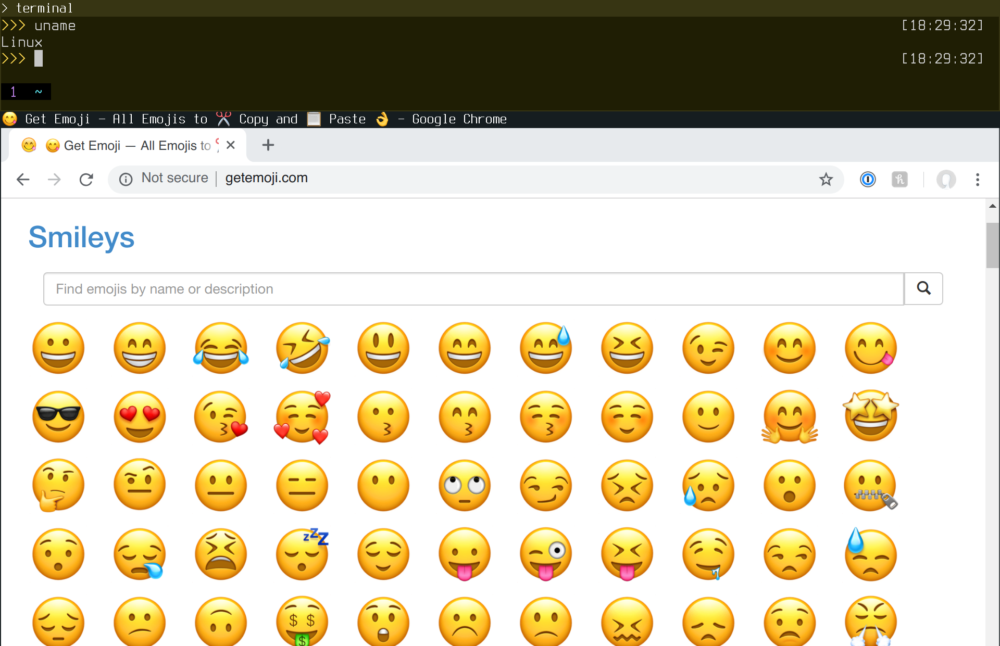

# apple-emoji-linux
Apple Color Emoji for Linux



### Getting Started

1.  Clone this repo

```sh
$ git clone git@github.com:samuelngs/apple-emoji-linux.git
```

2.  Install build dependencies

```sh
$ bundle install
```

3.  Build `AppleColorEmoji.ttf`

```sh
$ make -j
```

### Credits

- https://github.com/github/gemoji
- https://github.com/mattermost/mattermost-webapp
- https://github.com/googlei18n/noto-emoji
- https://github.com/googlei18n/nototools

### Disclaimer

The code provided is for educational purposes only. Apple & Apple Color Emoji is a trademark of Apple Inc., registered in the U.S. and other countries.
